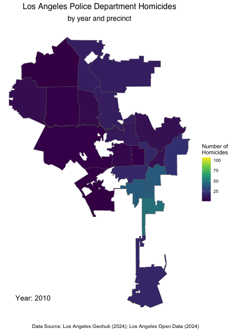

# Introduction

### Background
The COVID-19 pandemic significantly impacted society, ranging from the direct effects of contracting the illness, to the mental health and economic impacts of related lockdown and social distancing measures implemented. 

Despite initial assumptions that the disease did not discriminate, it soon became evident that individuals of certain demographic groups (ethnicity, age, income) were harder hit. In the US state of Michigan, despite only representing 14% of the population, Black residents accounted for 40% of COVID related deaths in early stages of the pandemic [Vox, 2020](https://www.vox.com/2020/4/10/21207520/coronavirus-deaths-economy-layoffs-inequality-covid-pandemic). 

Later, once a vaccine had been developed, serious inequalities in vaccine rollout between high income and low income individuals were uncovered. In the state of California, this was observed at a 60% difference in vaccination rates between wealthier vs. poorer areas [Boston University, 2022](https://www.bu.edu/eci/2022/03/10/how-covid-19-has-magnified-pre-existing-inequalities-in-the-us/).

In the UK, [a report by the Equality and Human Rights Commission](https://www.equalityhumanrights.com/sites/default/files/equality_and_human_rights_commission_how_coronavirus_has_affected_equality_and_human_rights_2020.pdf) highlights a number of ways in which, without ever having contracted the illness, disadvantages in Britain have widened for individuals of protected characteristics such as gender and race.

With this in mind, I wanted to explore a topic relating to the pandemic to inspect any other unseen effects of the pandemic.

### Research Questions
- **How has the COVID-19 pandemic impacted on homicide rates in Los Angeles?**
- **Are there any underlying patterns in changes observed?**

### Data Origins
The project focuses on LAPD data due to the richness of location data associated with crime reports and the openness of available data. The LAPD is also one of the largest police departments in the USA allowing for a large amount of data to be explored in the project. Over 3 million rows of data were obtained for analysis.

Raw data for this project were obtained from the website sources listed below:

- [2010 - 2019 LAPD crime data](https://data.lacity.org/Public-Safety/Crime-Data-from-2010-to-2019/63jg-8b9z/about_data)
- [2020 - present LAPD crime data](https://data.lacity.org/Public-Safety/Crime-Data-from-2020-to-Present/2nrs-mtv8/about_data)
- [LAPD precincts geojson file](https://geohub.lacity.org/datasets/lahub::lapd-divisions/about)

*NB: The above datasets were extracted for analysis and visualisation in November 2024. The raw data in these datasets will continue to change in future. Any visualisations and insights drawn are relate exclusively to the data which were available on the date of extraction*

# Setting Up

### Loading Packages

```{r setup, include = FALSE}
knitr::opts_chunk$set(echo = TRUE)

library(here)
library(tidyverse)
library(sf)
library(gifski)
library(gganimate)

```

The renv package was used in this project. Find the renv.lock file in my [repository](https://github.com/paulo-mp/project_6422) more detailed information about the libraries used and their versions. 

A brief list of the libraries installed and loaded for this project is also included below:

| Package    | Description                                        |
|------------|----------------------------------------------------|
| **here**   | Easy management of file paths and working directory|
| **tidyverse** | For related packages to manage data             |
| **sf**     | For working with spatial data                     |
| **gganimate** | For animated plots                             |
| **gifski** | For animation rendering                           |

### Loading Data

```{r loading data, message = FALSE, warning = FALSE}

# csv crime data
rawdata2010s <- read_csv(here("data", "raw", "crime_rawdata_2010s.csv")) 
rawdata2020s <- read_csv(here("data", "raw", "crime_rawdata_2020s.csv"))

# geojson spatial data
geo_map1 <- st_read(here("data", "map_data", "geo_data.geojson"))

```


# Data Wrangling

### Initial sanity checks 

I started by visually checking over the data. A few things I checked for and noticed are noted below:

- I started by understanding what the data was describing and identifying columns of interest. This informed the first steps of my data wrangling below.
- I noticed the "DATE.OCC" column in the crime data had the same time (midnight) for every row which indicated to me that it is false information.

### Processing crime data: Part 1

Informed by the initial checks, I began processing the crime data. I chose to merge the two crime datasets early on as they include the exact same variables, just covering different time spans. Following the merge I had over 3 million observations. 

Due to the size of the dataset I prioritised trimming down to the relevant data for my project. This involved trimming unnecessary columns and crimes which were not of interest. I also changed the formatting of columns for ease of interpretability and consistency in any later code.

```{r processing 1, message = FALSE, warning = FALSE, results = "hide"}

# changing DR_NO data class to character to match 2010s dataset and allow bind_rows to run
rawdata2020s_classchange <- rawdata2020s %>% mutate(DR_NO = as.character(DR_NO))

# merge the two separate datasets into one 
crimedata1_merged <- bind_rows(rawdata2010s, rawdata2020s_classchange)

# trim unnecessary columns
crimedata2_coltrim <- crimedata1_merged %>%
  select(
    `DATE OCC`, 
    `AREA`, 
    `AREA NAME`,
    `Crm Cd Desc`
  )

# renaming remaining columns
crimedata3_colrename <- crimedata2_coltrim %>%
  rename(
    "date_occ" = `DATE OCC`,
    "precinct_num" = `AREA`,
    "precinct_name" = `AREA NAME`,
    "crime_type" = `Crm Cd Desc`
  )

# checking for crime types of interest for the project
unique(crimedata3_colrename$crime_type)

# creating homicide variable to filter for homicide only (lynching category was included in this as I aim to focus on intentional and unlawful killings).
homicide <- c(
    "CRIMINAL HOMICIDE",
    "LYNCHING"
    )

# filtering for homicide crimes only 
homicidedata1 <- crimedata3_colrename %>%
  filter(
    crime_type %in% homicide
  )


```

### Second round of sanity checks

After some initial filtering and reformatting to make the data more manageable, I went through another round of checks. Each line of code below has a preceding comment explaining what I was checking.

In addition to the below checks, I also completed a visual sanity check to ensure the precinct numbers on both spatial and crime datasets referred to the same area and found no issues.

```{r sanity checks, results = "hide"}

# the data should cover a period from January 2010 - October 2024. Output does not show correct range. Error is due to R treating this column as a character variable. Date information will be extracted.
range(homicidedata1$date_occ) # "01/01/2010 12:00:00 AM" "12/31/2022 12:00:00 AM"


# following above check, now checking all data classes. Noted all will need to be changed. date_occ will be changed from "character" to "date", the remainder will be changed to "factor" as they are categorical variables.
columns <- c("date_occ", "precinct_num", "precinct_name", "crime_type")
sapply(homicidedata1[columns], class)

# there should only be 21 LAPD precincts. This is correct, but noticed geo_map will need padding to allow join with homicide data.
range(homicidedata1$precinct_num) # 01 - 21
range(geo_map1$PREC) # 1 - 21

```

### Processing crime data: Part 2

I identified a few other things to address within the checks above. I went through a second round of processing the data based on these checks.

```{r processing 2, message = FALSE, results = FALSE}

# changing categorical from character to factor
homicidedata2_factors <- homicidedata1 %>%
  mutate(
    `precinct_name` = as.factor(`precinct_name`),
    `crime_type` = as.factor(`crime_type`),
    `precinct_num` = as.factor(`precinct_num`)
  )

# changing date from character to date class following sanity checks above
homicidedata3_date <- homicidedata2_factors %>%
  mutate(
    date_occ = as.Date(sub(" .*", "", date_occ), format = "%m/%d/%Y")
  )

# checking range of dates - range is now as expected.
range(homicidedata3_date$date_occ) # "2010-01-01" "2024-10-07"

# creating summary data - not including 2024 data as we don't yet have the full year so won't be included in visualisations
homicide_summary_data <- homicidedata3_date %>%
  mutate(year = year(date_occ)) %>%
  filter(year < 2024) %>%
  group_by(precinct_num, precinct_name, year) %>%
  summarise(
    homicide_count = n(),
    .groups = "drop"
  )

```

### Processing spatial data

Next, I focused on applying some changes to the spatial data. This was mostly just formatting and preparation for a join, specifically:

- I trimmed away all columns, keeping only the precinct_num column (for joining) and the geometry columns (containing polygons).
- I renamed the precinct_num column to set up for the join.
- I padded the precinct_num column as I identified this inconsistency between the two datasets in earlier checks.

```{r processing geo, message = FALSE}

# renaming and trimming columns
geo_map2_renamed <- geo_map1 %>%
  rename(
    "precinct_num" = `PREC`,
  ) %>%
  select(
    precinct_num,
    geometry
  )

# padding the precinct_num column
geo_map3_pad <- geo_map2_renamed %>%
  mutate(
    precinct_num = as.character(precinct_num),
    precinct_num = str_pad(geo_map2_renamed$precinct_num, width = 2, side = "left", pad = "0"),
    precinct_num = as.factor(precinct_num)
  )

```

### Joining the data

In the line of code below I am executing the join of spatial and crime data ready for visualisations later in the process. I also complete one final missing values check to identify any potential issues with the join but found no concerns. Note, I also visually reviewed the data for any inconsistencies following the join but found no issues.

```{r join, message = FALSE, results = "hide"}

# performing left join on data
joined_spatial_data <- left_join(geo_map3_pad, homicide_summary_data, by = "precinct_num") %>%
  arrange(year, precinct_num)

# checking for missing values
colSums(is.na(joined_spatial_data))

```

### Saving the processed data

I chose to save the processed data (both joined spatial data and summary data) used in the subsequent visualisations. This will make it easier to pick up processed data and skip the data preparation code for those who prefer it.

```{r saving data, eval = FALSE}

# saving summary data
write_csv(homicide_summary_data, here("data", "processed", "homicide_summary_data.csv"))

# saving joined data
st_write(joined_spatial_data, here("data", "processed", "joined_spatial_data.geojson"))

```


# Data Visualisation

### Visualisation 1: Connected scatterpot

I started the visualisation process by exploring the patterns in the data before determining my next steps. I started with a simple line graph and quickly noticed a considerable spike in homicides in 2020. I noticed a general decline in the years following 2020, but a very steep drop in 2021 seemed to stick out from the general trend downwards post-pandemic.


```{r line graph}


# creating a connected scatterplot
homicides_scatter <- 
  homicide_summary_data %>%
  group_by(year) %>%
  summarise(total_homicide_count = sum(homicide_count)) %>% # creating a total count of homicides per year across LAPD
  ggplot(aes(x = year, y = total_homicide_count)) + # mapping aesthetics
  geom_line(colour = "grey") + # adding simple line graph layer
  geom_point(color = "#69b3a2", size = 4) + # layering with scatterplot for connected scatter graph
  labs(
    title = "Homicides within LAPD jurisdiction (2010-2023)",
    caption = "Data Source: Los Angeles Open Data (2024)", # citing the data source
    x = "Year",
    y = "Number of Homicides"
  ) + # editing labels
  theme_minimal() + # opting for a minimal theme
  theme(
    plot.title = element_text(size = 15, family = "Helvetica", face = "bold"),  # title font
    axis.title = element_text(size = 10, family = "Helvetica", face = "bold"),  # axis title font
    panel.grid.minor = element_blank(), # removing all minor gridlines
    panel.grid.major.x = element_blank() # removing major x gridlines
  ) +
  scale_x_continuous(breaks = seq(2010, 2023, by = 1))  # including all years on x axis

# viewing the plot
homicides_scatter

```

### Saving the first visualisation

```{r saving, eval = FALSE}

# saving the plot
ggsave(
  filename = here("plots", "homicides_scatter.png"),
  plot = homicides_scatter
  )

```


### Visualisation 2: Animated choropleth map

Following my initial graph, I felt it would be helpful to visualise the trends geographically for a different perspective on the data. I found this visualisation particularly helpful in highlighting two main issues:

- First, I noticed a considerable lack of data in 2021 compared to all other years, with entire precincts lacking data for the whole year. This explained the steep decline in my first visualisation which seemed out of trend. It also raised a new issue with how best to visualise the data.
- Second, I noticed that, despite a considerable impact of the pandemic on homicides as a whole, the effect seems concentrated in certain parts of the map. This was my initial confirmation of the research question. 

Following these insights I gained from my second visualisation, I began to consider how best to craft my final visualisation.


```{r animation, eval = FALSE}

# creating the animation
homicides_choropleth <- 
  animate(
    ggplot(joined_spatial_data) + # using joined spatial dataset
      geom_sf(aes(fill = homicide_count)) + # fill by number of homicides in a polygon each year
      geom_text(
        aes(label = paste("Year:", year)), # dynamic year label
        x = -118.65,  
        y = 33.72,    # manual coordinates for label - chose bottom left due to layout of map 
        size = 5, color = "black", hjust = 0, vjust = 0, check_overlap = TRUE # adjusting format of label
      ) + 
      transition_time(year) + # animating by year
      theme_void() + # minimal theme
      scale_fill_viridis_c() + # colour-blind friendly scale applied
      labs(
        title = "Los Angeles Police Department Homicides", 
        subtitle = "by year and precinct",
        fill = "Number of\nHomicides",
        caption = "Data Source: Los Angeles Geohub (2024); Los Angeles Open Data (2024)"
      ) + # added labels
      theme(
        plot.title = element_text(size = 16, family = "Helvetica", hjust = 0.5),
        plot.subtitle = element_text(size = 14, family = "Helvetica", hjust = 0.5),
        plot.caption = element_text(face = "italic", size = 10)
      ), # adjusting formatting of text in visualisation
    nframes = length(unique(joined_spatial_data$year)), # setting number of years as number of frames
    width = 450, # setting width
    height = 650, # setting height
    fps = 1 # low fps to allow time to look at each choropleth map shown
  )


# view the animation
homicides_choropleth

# saving the animation
anim_save(
  filename = here("plots", "homicides_choropleth.gif"),
  animation = homicides_choropleth
  )

```



### Visualisation 3: Dumbbell Plot

**Choosing the visualisation**

For my third and final visualisation, I chose to focus on the steep jump in homicides between 2019 and 2020. I considered looking at "pre" and "post" pandemic averages but felt this would dilute the point of the visualisation which was to explore the spike in homicides and understand where this effect was most profound. Post-pandemic trends were also difficult to assess due to the considerable amount of missing data in 2021. 

I wanted my visualisation to give the viewer a sense of "direction" of the effect. With 21 precincts, it was also important to not overload the viewer with too much visual clutter. I chose a dumbbell chart due to its ability to succinctly visualise two points for a number of categories and allow easy comparison between the two.

**Formatting decisions**

I tried to make purposeful decisions with my formatting to draw the viewer's attention to the story the visualisation is telling. One way I did this was by minimising grid lines to reduce background noise. 

I also chose to colour and size the "2019" point more subtly, as this was to act as the "baseline" which the effect is mapped onto. I achieved this effect by giving the dotted line and the "2020" point the same colour. My aim in doing this was to give the viewer a sense of continuity between the two. My intention was to create an effect of distance travelled to "arrive" at the second data point.

Some other formatting decisions I made were in reducing text size of x/y labels and applying a grey colour to the subtitle. These choices were all made in an attempt to reduce the aspects of the graph pulling on the viewer's attention. These aspects are still visible for when the viewer wants that information, but they aren't the first thing the attention is pulled to.

This process did involve some re-wrangling of the data, so the code chunk starts with that.

```{r, final visualisation, fig.width = 10, fig.height = 5}

# filtering and trimming away unnecessary data
dumbbell_data_filter <- homicide_summary_data %>%
  filter(year %in% c(2019, 2020))

# reformatting as wide data
dumbbell_data_wide <- dumbbell_data_filter %>%
  pivot_wider(
    names_from = year,
    values_from = homicide_count,
    names_prefix = "count_"
  ) 

# wrapping subtitle
wrapped_subtitle <- str_wrap(
  "The LAPD reported a sharp rise in homicides in the first year of the pandemic, but to differing degrees across precincts",
  width = 110)

# creating the plot
homicides_dumbbell <- ggplot(dumbbell_data_wide) +
  geom_segment(aes(
    x = count_2019, xend = count_2020,
    y = reorder(precinct_name, count_2020), yend = reorder(precinct_name, count_2020)
  ), linetype = "dotted", color = "#27408B", linewidth = 0.4) + # creating dotted line - colour matches point of interest (2020 count)
  # small orange dots for 2019
  geom_point(aes(x = count_2019, y = reorder(precinct_name, count_2020), color = "2019"), size = 2) +
  # larger blue dots for 2020 - to focus consumer's eye on the point of interest
  geom_point(aes(x = count_2020, y = reorder(precinct_name, count_2020), color = "2020"), size = 3.5) +
  # setting point/legend colours
  scale_color_manual(
    name = "Year",  
    values = c("2019" = "#FFB385", "2020" = "#27408B")
  ) +
  labs(
    title = "Los Angeles Police Department Homicide Rates",
    subtitle = wrapped_subtitle, # inputting the wrapped subtitle from above
    caption = "Data Source: Los Angeles Open Data (2024)", # citing the data source
    x = "Number of Homicides",
    y = "LAPD Precinct"
  ) +
  theme_minimal() +
  theme(
    axis.text.y = element_text(size = 9, family = "Helvetica"),  # y-axis label size and font
    axis.text.x = element_text(size = 9, family = "Helvetica"),  # x-axis label size and font
    plot.title = element_text(size = 16, family = "Helvetica", face = "bold"),  # title font
    plot.subtitle = element_text(size = 13, family = "Helvetica", color = "grey"),  # subtitle font
    axis.title = element_text(size = 10, family = "Helvetica", face = "bold"),  # axis title font
    panel.grid.major.y = element_blank(), # removing horizontal grid lines
    panel.grid.minor = element_blank() # removing minor vertical lines
  )

# viewing the final visualisation
homicides_dumbbell

```

### Saving final visualisation and data

```{r final save, eval = FALSE}

# saving summary data
write_csv(dumbbell_data_wide, here("data", "processed", "dumbbell_data_wide.csv"))

# saving final visualisation
ggsave(
  filename = here("plots", "homicides_dumbbell.png"),
  plot = homicides_dumbbell
  )

```

# Conclusion

### Interpretation
My final visualisation clearly shows the significant difference in homicide rates from 2019 to 2020. The visualisation effectively breaks down the difference by precinct, allowing the viewer to understand where the changes were most pronounced. 

The four precincts with the heighest rates of homicide in 2020 (Southeast, Newton, 77th Street, and Olympic), are all within the central and southeast areas covered by the LAPD. These areas appear to also be the lowest income areas of Los Angeles [Economic Roundtable](https://economicrt.org/publication/concentrated-poverty-in-los-angeles/). 

It seems that the visualisation answers the initial questions. The COVID-19 pandemic resulted in a significant increase in homicide rates across Los Angeles. However, not for all residents. Residents of central and southeast Los Angeles were most likely to feel the impacts of this change. Incidentally, these are also some of the lower income areas of Los Angeles.

### Reflections on the project
As this was my first experience coding and working with data, there are a few reflections to discuss from my experience on this project.

**Interpretability**

First, an important improvement for my visualisation would be to make it more widely accessible and interpretable. I tried to make my visualisation with an "audience" in mind. I imagined communicating this information to local services, government, charities, etc. who may have stakes in understanding who the victims of homicide are and when/where people become more vulnerable. I considered the LAPD in this "audience" too, as the point of using their data was to understand trends at a local level where targeted changes and preparations could be made. 

On reflection, in keeping such a specific audience in mind I also assumed a high level of pre-existing knowledge about Los Angeles' geography and neighbourhoods. The graph includes no more information about the areas aside from their names. That means that anyone trying to interpret the information who doesn't know these areas has to seek out detail elsewhere, rather than receiving the entire message from the visualisation. Including some information about the demographics of the precinct residents or homicide victims would add important context.

An additional point regarding interpretability should be made about the raw homicide count. Percentage change was initially considered but seemed to communicate the wrong message about the data, with small changes at times equating to inflated percentages. A relative population density figure (e.g. number of homicides per 1000 residents) would have been ideal for this. It would allow for more direct comparison between precincts and even to other cities.

**Availability of data**

A limitation of this project was also the availability of data. With 2021 data completely missing in almost half of the precincts and very poor recording in the remainder of precincts, including any data from this calendar year in a visualisation would have been misleading. That also meant exploring overall trends following the pandemic became considerably more difficult.

**Breaking the data down further**

My project looked at homicide rates as a whole but insights from the visualisations could be made more actionable by grouping in a few different ways. For example, checking for gang-related homicides, drug-related homicides, domestic homicides. Any patterns here would be helpful for the "audience" I mentioned above to be able to make effective preparations. For example, if all other types of homicide remain the same but drug-related homicides increase with lockdown measures, the LAPD might focus their preparations for another lockdown (or similar measure) very differently than if data was just communicated as an overall increase in homicides. Similarly, if domestic homicides accounted for most of that change, outreach programmes and relevant charities may benefit from understanding where the effects are most concentrated.
